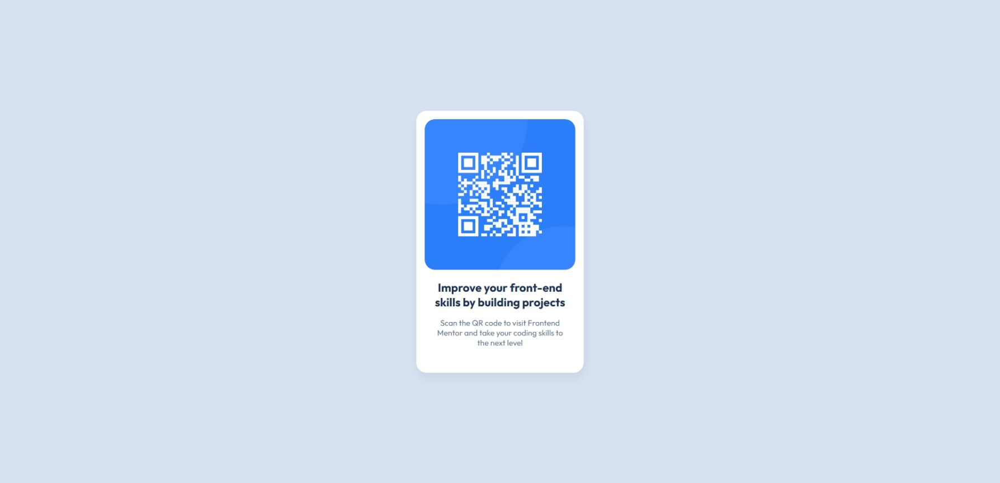
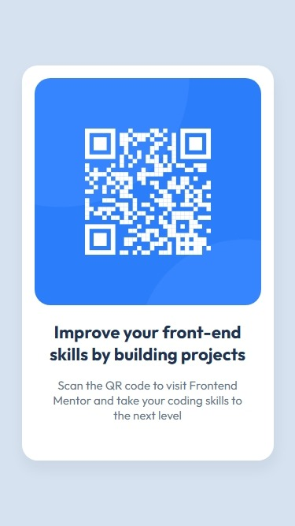

# Frontend Mentor - QR code component solution

This is a solution to the [QR code component challenge on Frontend Mentor](https://www.frontendmentor.io/challenges/qr-code-component-iux_sIO_H). Frontend Mentor challenges help you improve your coding skills by building realistic projects. 

## Table of contents

- [Overview](#overview)
  - [Screenshot](#screenshot)
  - [Links](#links)
- [Author](#author)
- [Tech Stack](#%EF%B8%8F-tech-stack)

## Overview

### Screenshot

  
  

### Links

- Solution URL: [Frontend Mentor](https://www.frontendmentor.io/solutions/frontend-mentor---qr-code-component-solution-mQoJ6YrjSJ)
- Live Site URL: [GitHub Pages](https://maluwhoo.github.io/Frontend-Mentor-QR-code-component/)

## Author

- Website - [Malu's GitHub](https://github.com/MaluWhoo)
- Frontend Mentor - [@MaluWhoo](https://www.frontendmentor.io/profile/MaluWhoo)

## 🛠️ Tech Stack

